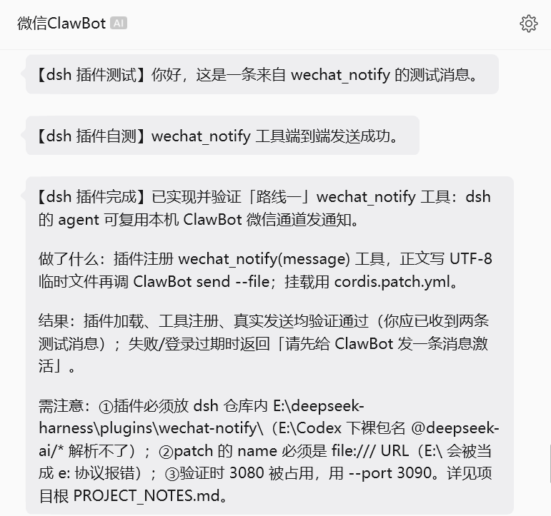

<p align="center">
  <h1 align="center">dsh-wechat-notify</h1>
  <p align="center">
    A <a href="https://github.com/deepseek-ai/deepseek-harness">DeepSeek Harness</a> (dsh) plugin that lets your agent <strong>reach you on WeChat</strong>.
  </p>
  <p align="center">
    <a href="LICENSE"></a>
    
    
  </p>
</p>

> 如果你正在寻找稳定、实惠的 AI 模型中转服务，可以试试 [FastAiToken](https://www.fastaitoken.com/register?aff=BF9KNKFHX725)，也可以先阅读[中转站新手帮助文档](https://github.com/wssfk12138/fastaitoken-beginner-guide)了解中转站、倍率、计费和使用方式。你在 FastAiToken 中的每一笔消费都会让作者获得一定数量的返利，我会把它转化为 Token，继续开发更多新项目并上传至 GitHub。当前所有项目均使用了 FastAiToken 提供的 5.6 Sol 模型参与开发。

<p align="center">
  
</p>

<p align="center">
  <em>实机演示：任务完成后，agent 主动把结果通知推送到你的微信。</em>
</p>

---

## 这是什么？

`dsh-wechat-notify` 是 [DeepSeek Harness](https://github.com/deepseek-ai/deepseek-harness)（dsh）的一个插件。
它给 agent 的「工具箱」里新增一个 `wechat_notify` 工具，让 agent 在需要找你的时候——比如任务完成、
遇到需要你拍板的问题、或长时间运行结束——主动发一条微信通知到你手机上。

它复用的是你本机**已经登录、已经跑通的 ClawBot 微信通道**，不需要额外搭建服务。
首次连接微信时，还提供扫码登录工具（`wechat_login` / `wechat_login_confirm`），全程可在 dsh 内完成。

## ✨ 特性

- **一个工具搞定**：注册 `wechat_notify(message)`，agent 想找你时直接调用。
- **中文可靠**：正文走 UTF-8 文件传递，中文不会变乱码或问号。
- **结果可读**：返回「已发送」或清晰的失败原因，agent 能直接转述给你。
- **掉线自提示**：检测到微信会话过期（如 `prepare failed`）时，会提示「先给机器人发条消息激活」。
- **零残留**：临时文件用完即删。
- **零隐私硬编码**：微信机器人路径由环境变量注入，仓库里不含任何本机路径。
- **扫码登录**：`wechat_login` 一键获取微信登录二维码，`wechat_login_confirm` 确认并保存凭据，首次连接无需离开 dsh。

## 📸 演示

任务完成后，agent 调用 `wechat_notify`，你的微信会收到类似上图的通知（默认发给机器人登录者本人）。

## 📋 前置要求

- 一个 [DeepSeek Harness](https://github.com/deepseek-ai/deepseek-harness) 源码仓库（developer preview）。
  插件依赖 `@deepseek-ai/dsh-tools` 与 `@deepseek-ai/cordis`，这两个包由 dsh 自身解析，无需单独安装。
- 一个本机可用的微信发送器（ClawBot 通道），它的 CLI 需支持：

  ```text
  node <入口.js> send --file <消息文件>
  ```

## 🚀 安装

1. 把本插件放进 dsh 仓库内（这样 dsh 才能解析 `@deepseek-ai/*` 依赖）。例如：

   ```text
   <dsh>/plugins/wechat-notify/
   ├── src/index.ts
   ├── cordis.patch.example.yml
   ├── package.json
   └── tsconfig.json
   ```

2. 配置微信发送器入口（环境变量）：

   ```sh
   # Linux / macOS
   export WECHAT_NOTIFY_CLAWBOT_INDEX="/path/to/clawbot/dist/index.js"
   ```

   ```powershell
   # Windows PowerShell
   $env:WECHAT_NOTIFY_CLAWBOT_INDEX = "D:\path\to\clawbot\dist\index.js"
   ```

   忘记配置也没关系——工具会返回一句「请先设置 …」的提示，而不是报错。

3. 挂载插件：复制 `cordis.patch.example.yml` 为真实 patch 文件，把其中的占位路径换成
   `src/index.ts` 的绝对路径（Windows 需写成 `file:///` URL，见文件内注释），然后启动：

   ```sh
   node --import tsx/esm apps/cli/src/bin.ts web --patch /path/to/cordis.patch.yml
   ```

   看到日志输出 `[wechat-notify] plugin loaded` 即表示加载成功。

## 📖 用法

### 发送通知

加载后，agent 就可以调用：

```text
wechat_notify(message="任务已完成，结果如下：……")
```

返回形如：

```text
微信通知已发送：任务已完成，结果如下：……
```

或失败时的可读说明（含「请先给 ClawBot 发一条消息激活」的掉线提示）。

### 首次连接微信（扫码登录）

若 ClawBot 还没登录微信（全新环境或登录已过期），让 agent 依次调用：

```text
wechat_login()          # 生成可扫的登录二维码（直接显示在 dsh 页面）
wechat_login_confirm()  # 你扫码确认后，保存登录凭据
```

具体流程：`wechat_login` 会返回一张**可扫的二维码图片**（并附 liteapp 链接兜底）——直接用手机
微信「扫一扫」扫 dsh 页面上的二维码，手机上确认登录后，再让 agent 调用 `wechat_login_confirm`
即可完成连接；之后 `wechat_notify` 就能正常发通知。

## 🔧 工作原理（通俗版）

1. agent 需要找你时，把想说的话交给 `wechat_notify` 工具。
2. 工具先把这段话**工整地抄到一张临时小纸条**（UTF-8 文件）上——这样中文一个字都不会错。
3. 再替 agent 去敲一下本机的微信机器人：「帮我把这张纸条发给机主。」
4. 机器人通过微信把通知送到你手机。
5. 纸条用完即撕，工具再把「已发送 / 失败原因」回报给 agent。

一句话：它像 agent 的**跑腿**，把 AI 的话写成便条，交给本机已登录的微信机器人投递，投完再回来复命。

## 🗺️ 路线图（Roadmap）

- [ ] 支持发给指定好友 / 多目标 / 微信群
- [ ] 富文本与多媒体（图片、文件、卡片消息）
- [ ] 事件驱动自动推送（任务完成、报错、长时间运行结束）
- [ ] 双向交互（收到你的微信 → 触发 agent）
- [ ] 发送历史与消息模板
- [ ] 队列、重试与限流
- [ ] 抽象多通道（钉钉 / 飞书 / Telegram / Slack）

## 🤝 贡献

欢迎提 Issue 和 PR。dsh 目前是 developer preview，接口可能调整，提交前请以最新的 dsh 插件文档为准。

## 📄 许可

[MIT](LICENSE) © 往事随风K
